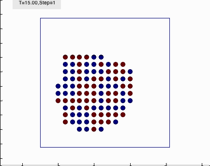
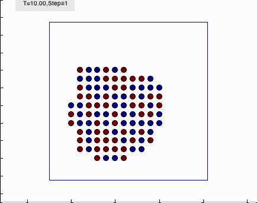
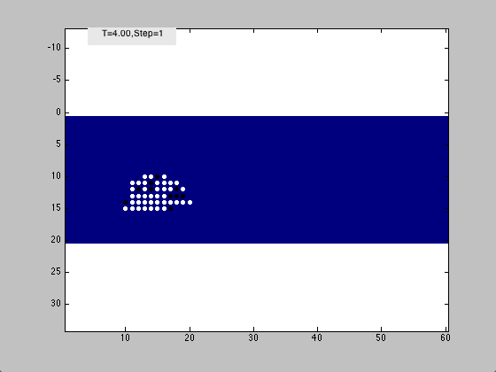

---

<h1 class="page-header text-center"> Animations </h1>
These are videos that I rendered from various projects I worked on during my undergrad and graduate careers.
<video src="eversion_03112010.mp4" width="640" height="400" controls preload></video>
 
Eversion of DNA base into active site. I made the video, not the trajectory. I made a moviemaker to make movies like this. Contact me if you want a copy of this software.

 
<video src="Indent_normal.mp4" width="640" height="400" controls preload></video>
 
Nanoindentation of red blood cell simulated using finite element method. This comes from my work in the Qin Lab at Stony Brook. 
Red blood cells are considered hyperelastic, and continually squeeze through capillaries half the diameter of the cells. 
We were interested in testing these deformations, and how red blood cells react to stresses when their elasticity is compromised. 

 

 
Simulated annealing of particles (cells) with different levels of adhesivity: W(Red to Blue), and cohesivity: W(Red to Red) and W(Blue to Blue).
Left: W(Red to Blue)>W(Blue to Blue) and W(Red to Blue)>W(Red to Red). Middle: W(Blue to Blue)>W(Red to Blue)>W(Red to Red). 
Right W(Red to Red)>W(Red to Blue) and W(Blue to Blue)>W(Red to Blue). It is interesting to see how the self organized configuration by 
vary by just changing a few parameters. This is from a mini project that I worked on during my first year at UCSF.

 

 
This is the same kind of simulation as above, but with a few more rules.
The cohesivities are greater than the adhesivity, but now the smaller group of cells create a diffusing chemical that repels
the larger group of cells. The cells move down the diffusion gradient. With a couple of more rules, the cell mass can now 
migrate autonomously.